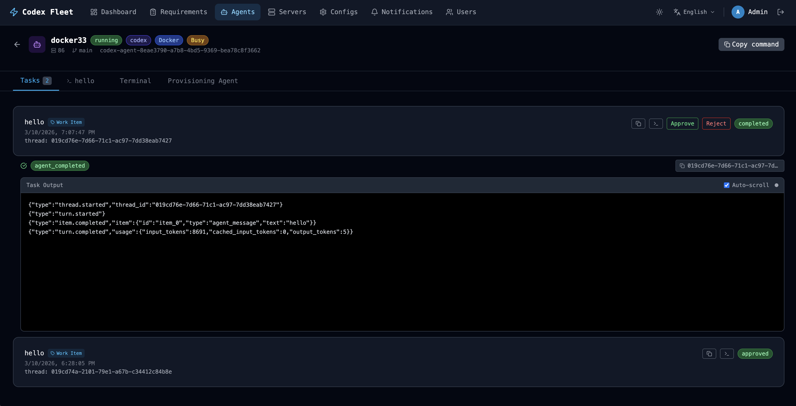

# Codex Fleet

> ⚠️ **Work in progress, actively vibe coding, bugs are expected.**

A web control plane for managing multiple AI coding agents (Codex, etc.). Agents can run on your remote servers or directly on the local machine. Open the browser, create agents, dispatch tasks, and watch them work.

[中文文档 →](./README_CN.md)

## UI Preview



---

## Planned

1. Support skill/MCP configuration from multiple sources.
2. Turn the requirements view into a Linear-style waterfall board that can be dragged left and right.
3. Support more CLI tools and make the configuration model modular.
4. Add a menu that lets AI automatically run test cases.
5. Parse structured JSON output from Codex.
6. Other UX improvements.

> Note: Rust is used because Codex itself is built with Rust, and this project is also a way to learn it. Development speed depends on how fast my token refreshes (lol).

---

## Quick Start (Docker)

```bash
git clone git@github.com:jyokotori/codex-fleet.git
cd codex-fleet
cp .env.example .env   # change credentials before using in production

docker compose up -d
```

Open **http://localhost:3000**

Default admin login: **`codex` / `codex`**

---

## Local Development

```bash
# 0. Copy the environment file first if you have not done it yet
cp .env.example .env

# 1. Start postgres only
docker compose up postgres -d

# 2. Start the backend (one terminal)
cargo run -p backend

# 3. Start the frontend dev server with hot reload (another terminal)
cd frontend && npm install && npm run dev
```

Frontend dev server: **http://localhost:5173** (`/api` and `/ws` are proxied to the backend)

---

## Current

### Server Management
Add remote servers and test SSH connectivity with one click. Supports passwordless SSH, password authentication, and SSH keys. Once added, all agents on that server automatically use that connection.

### Agent Management
When creating an agent, choose a remote server, select the CLI tool (currently Codex only), and optionally enable Docker. Git setup in the create dialog is currently shown as WIP for both Docker and non-Docker modes.
Provisioning always creates two directories on the server:
- `~/.codex-fleet/{agent_id}/agent`: stores agent configuration
- `~/.codex-fleet/{agent_id}/workspace`: project working directory
If Docker is enabled, these two directories are mounted into the container as `/agent` and `/workspace`, and the Docker configuration is applied (ports, environment variables, mounts, init script).

Each agent can be configured independently:
- **Codex Config** — bind a `config.toml` + `auth.json` bundle so the agent starts with credentials and settings ready
- **AGENTS.md** — inject a shared project instruction file into the agent workspace
- **Docker Config** — customize port mappings, environment variables, volume mounts, and init scripts
- **Runtime controls** — Docker agents show a single action button in the list view that changes with container state (`Stop`, `Start`, or `Restart`); `Stop` and `Restart` require confirmation, while `Start` runs immediately. Non-Docker agents do not expose Start/Stop/Restart buttons. The agent detail header keeps only `Dispatch Task` and `Copy command`
- **Status sync** — the frontend still reads a single persisted agent status (`provisioning`, `running`, `stopped`, `error`), but the backend syncs the real Docker runtime state back into that field; non-Docker agents are synced to `running` / `stopped` based on SSH reachability
- **Copy as new agent** — the copy action in the list opens the create dialog with server, CLI, Docker, and config settings prefilled so you can adjust them before creating a new agent; Git setup remains WIP in the create flow and is not copied
- **Delete confirmation** — deleting any agent requires explicit confirmation; it removes `~/.codex-fleet/{agent_id}` and the database record, and Docker agents also remove the container

### Task Dispatch
Before manual dispatch, the agent must be idle and its synced status must be `running`. This rule is the same for both Docker and non-Docker agents, and the backend syncs status again before execution. The scheduler only auto-dispatches `waiting` work items to agents that are both `running` and idle.

### Requirements Management
Create projects and work items, assign them to agents or users, link them to agent executions, and review agent results from the requirement detail page.

### Live Logs & Terminal
- **Logs tab** — shows real-time output from the agent session and auto-scrolls
- **Terminal tab** — full interactive terminal, so you can type commands directly in the runtime environment (container or host)
- **Copy command** — non-Docker agents copy a direct SSH command to the host; Docker agents copy an SSH command that enters the container shell

### Configuration Management
Store reusable configurations centrally and attach them to any agent at any time:
- **Codex Configs** — combine `config.toml` and `auth.json` into a named config bundle
- **AGENTS.md** — reusable agent instruction files
- **Docker Configs** — reusable Docker runtime configurations (ports, mounts, environment variables, init scripts)

### Notifications
Configure webhooks so task progress, completion, failure, approval, or rejection is pushed automatically.

### User & Access Management
- JWT access token + refresh token
- Role-based access control (RBAC) with fine-grained permission codes
- Admin-only user management: create users, reset passwords, enable/disable, unlock
- Self-service for regular users: change their own password
- Regular users only load and see the agents assigned to them on shared pages; admin-only server inventory is not fetched or shown for non-admin sessions

---

## Architecture Evolution

The backend evolves in the following order:

1. IAM
2. Config Center
3. Server + Agent Runtime
4. Notification Center

---

## Updating the SQLx Offline Cache

After changing SQL queries, regenerate the `.sqlx/` cache or Docker builds will fail:

```bash
cargo install sqlx-cli --no-default-features --features native-tls,postgres
./scripts/prepare-sqlx.sh
```

---

## License

Apache 2.0
