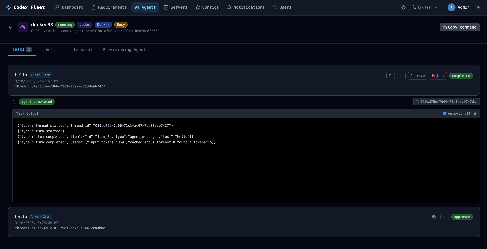

# Codex Fleet

A web control plane for managing multiple AI coding agents (Codex, etc.). Agents can run on your remote servers or directly on the local machine. Open the browser, create agents, dispatch tasks, and watch them work.

[中文文档 →](./README_CN.md)

## UI Preview



---

## Planned

1. Support skill/MCP configuration from multiple sources.
2. Support more CLI tools and make the configuration model modular.
3. Add a menu that lets AI automatically run test cases.
4. Parse structured JSON output from Codex.
5. Other UX improvements.

> Note: Rust is used because Codex itself is built with Rust, and this project is also a way to learn it. Development speed depends on how fast my token refreshes (lol).

---

## Quick Start (Docker)

```bash
git clone git@github.com:jyokotori/codex-fleet.git
cd codex-fleet
cp .env.example .env   # change credentials before using in production

docker compose up -d
```

Open **http://localhost:3001**

Default admin login: **`codex` / `codex`**

---

## Local Development

```bash
# 0. Copy the environment file first if you have not done it yet
cp .env.example .env

# 1. Start postgres only
docker compose up postgres -d

# 2. Start the backend (one terminal)
cargo run -p backend

# 3. Start the frontend dev server with hot reload (another terminal)
cd frontend && npm install && npm run dev
```

Frontend dev server: **http://localhost:5173** (`/api` and `/ws` are proxied to the backend)

### Environment Configuration
Current runtime configuration includes the PostgreSQL connection pool:

```bash
DB_MAX_CONNECTIONS=30
DB_ACQUIRE_TIMEOUT_SECS=10
```

`DB_MAX_CONNECTIONS` should stay below PostgreSQL's available `max_connections` after leaving room for admin sessions and other tools. Increase it when many task streams or webhooks run concurrently.

DingTalk credentials (`app_key`, `app_secret`, `robot_code`) are managed in the database via the admin UI: **Configuration → DingTalk**. They are no longer read from `.env`. Until they are saved and the integration is enabled, the DingTalk user sync button and DingTalk notification type are hidden in the UI.

The DingTalk user sync password is not persisted. Admins enter the default password in the user management page each time they start a sync job.

Per-user API access tokens are managed under **Configuration → API Access Token**. Each user can generate (or regenerate) a single token and use it as `Authorization: Bearer <token>` to call any system API. Requests authenticated with the token are processed as that user and inherit their roles and permissions. Regenerating immediately revokes the previous token.

### Building a Custom Agent Docker Image (Recommended)

If you plan to run agents in Docker mode, it is recommended to pre-build a dedicated programming image with all necessary tools installed, rather than using a bare base image each time.

You can reference [codex-universal Dockerfile](https://github.com/openai/codex-universal/blob/main/Dockerfile) for a well-structured example.

```bash
# 1. Start a container from a base image
docker run -it --name my-codex-env ubuntu:24.04 bash

# 2. Inside the container, install the tools you need
#    e.g. git, curl, node, python, codex-cli, etc.
apt-get update && apt-get install -y git curl build-essential ...

# 3. Exit the container
exit

# 4. Commit the container as your custom image
docker commit my-codex-env my-codex-image:latest

# 5. Clean up the temporary container
docker rm my-codex-env
```

Then select `my-codex-image:latest` as the Docker image when creating an agent.

---

## Current

### Server Management
Add remote servers and test SSH connectivity with one click. Supports passwordless SSH, password authentication, and SSH keys. Once added, all agents on that server automatically use that connection.

### Agent Management
When creating an agent, choose a remote server, select the CLI tool (currently Codex only), and optionally enable Docker. Git setup in the create dialog is currently shown as WIP for both Docker and non-Docker modes.
Provisioning always creates two directories on the server:
- `~/.codex-fleet/{agent_id}/agent`: stores agent configuration
- `~/.codex-fleet/{agent_id}/workspace`: project working directory
If Docker is enabled, these two directories are mounted into the container as `/agent` and `/workspace`, and the Docker configuration is applied (ports, environment variables, mounts, init script).

Each agent can be configured independently:
- **Codex Config** — bind a `config.toml` + `auth.json` bundle so the agent starts with credentials and settings ready
- **AGENTS.md** — inject a shared project instruction file into the agent workspace
- **Docker Config** — customize port mappings, environment variables, volume mounts, and init scripts
- **Runtime controls** — Docker agents show a single action button in the list view that changes with container state (`Stop`, `Start`, or `Restart`); `Stop` and `Restart` require confirmation, while `Start` runs immediately. Non-Docker agents do not expose Start/Stop/Restart buttons. The agent detail header keeps only `Dispatch Task` and `Copy command`
- **Status sync** — the frontend still reads a single persisted agent status (`provisioning`, `running`, `stopped`, `error`), but the backend syncs the real Docker runtime state back into that field; non-Docker agents are synced to `running` / `stopped` based on SSH reachability
- **Copy as new agent** — the copy action in the list opens the create dialog with server, CLI, Docker, and config settings prefilled so you can adjust them before creating a new agent; Git setup remains WIP in the create flow and is not copied
- **Delete confirmation** — deleting any agent requires explicit confirmation; it removes `~/.codex-fleet/{agent_id}` and the database record, and Docker agents also remove the container

### Task Dispatch
Before manual dispatch, the agent must be idle and its synced status must be `running`. This rule is the same for both Docker and non-Docker agents, and the backend syncs status again before execution. Automatic dispatch is driven by the Plane integration scheduler.

### Live Logs & Terminal
- **Logs tab** — shows real-time output from the agent session and auto-scrolls; structured task events are rendered as separate blocks for agent messages, command executions, file changes, tool calls, and web searches, with Markdown/GFM rendering for agent replies plus expandable command output and diffs
- **Terminal tab** — full interactive terminal, so you can type commands directly in the runtime environment (container or host)
- **Copy command** — non-Docker agents copy a direct SSH command to the host; Docker agents copy an SSH command that enters the container shell

### Configuration Management
Store reusable configurations centrally and attach them to any agent at any time:
- **Codex Configs** — combine `config.toml` and `auth.json` into a named config bundle. The edit dialog provides a **Save & push to bound agents** action that writes the new content to every running agent referencing this config (Docker agents via `docker exec` into `/root/.codex/...`, non-Docker agents via SSH into `~/.codex-fleet/{id}/agent/...`), so changes take effect without re-provisioning. Empty fields and unset references are skipped (existing remote files are not deleted).
- **AGENTS.md** — reusable agent instruction files
- **Docker Configs** — reusable Docker runtime configurations (ports, environment variables, init scripts; agents always mount a managed `/workspace` named volume)

### Notifications
Current:
- Configure webhooks so task progress, completion, and failure are pushed automatically.
- Configure DingTalk notifications without storing credentials in notification records; DingTalk credentials are managed in **Configuration** (admin-only).
- DingTalk task notifications are sent to the DingTalk user ID on the user assigned to the task's Agent. If the Agent has no assigned user, or that user has no `dingtalk_userid`, the notification is skipped.

### Plane Integration
Integrate with [Plane](https://plane.so) for bidirectional issue sync. Each binding declares its own three project states (accept / in-progress / completion) and a list of labels mapped to specific CLIs (`codex`, plus reserved `claude_code` / `gemini_cli` / `opencode`). Issues entering the binding's accept state — with a matching label and assigned to a known agent group member — are automatically dispatched, and results are written back as state transitions and comments. Each binding can also opt into one or more notification configs (e.g. DingTalk), so Plane-dispatched tasks fire the same `agent_in_progress` / `agent_completed` / `agent_failed` events as user-created tasks. See [Plane Integration Guide](./docs/plane-workflow.md) for setup instructions.

### User & Access Management
- JWT access token + refresh token
- Role-based access control (RBAC) with fine-grained permission codes
- Admin-only user management: create users, reset passwords, enable/disable, unlock
- Admin-only DingTalk user sync from the user management page. The sync dialog requires a default password of at least 8 characters for newly created users.
- DingTalk sync matches users by DingTalk `email` only. A unique email match updates `display_name`, `email`, `mobile`, and `dingtalk_userid`; no match creates a `member` user with `username` derived from the email prefix; empty or duplicate email matches are skipped and reported in the sync result.
- Self-service for regular users: change their own password
- Regular users only load and see the agents assigned to them on shared pages; admin-only server inventory is not fetched or shown for non-admin sessions

---

## Architecture Evolution

The backend evolves in the following order:

1. IAM
2. Config Center
3. Server + Agent Runtime
4. Notification Center

---

## Updating the SQLx Offline Cache

After changing SQL queries, regenerate the `.sqlx/` cache or Docker builds will fail:

```bash
cargo install sqlx-cli --no-default-features --features native-tls,postgres
./scripts/prepare-sqlx.sh
```

---

## License

Apache 2.0
